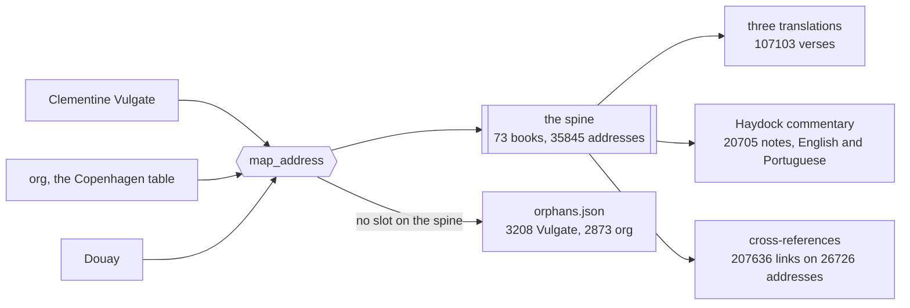

# catholic-bible

[Português](README.pt-BR.md)

A read-only API and a published dataset for the Catholic Bible. 73 books,
Portuguese, English and Latin, public domain throughout.

## Status

Scripture is here and it is readable over HTTP. Three translations, 107103
verses, addressed on a versification spine of 35845 slots.

Commentary is here too. The Haydock, 20705 notes over all 73 books, in English
and in Portuguese, anchored on the same verse ids.

The Portuguese Haydock is the part of this project that does not exist anywhere
else, and it was **translated by a language model**. The prompt required faithful
rendering, Catholic ecclesiastical terminology and untouched Scripture citations.
The English beside it is the 1859 transcription and it was not touched.

**Human review is pending and wanted.** A seeded sample of 200 entries sits at
`docs/qa/haydock-translation-sample.csv` ready to be read, and
`docs/qa/haydock-translation-review.md` records what has been checked so far and
by what. If you read
Portuguese and Latin, this is the most useful thing anyone could contribute.

Cross-references are here as well. 207636 of them on 26726 addresses, from
three sources, and the one thing worth knowing about them is in the next
section.

All of it is also published as static files on a CDN, which is the cheapest way
to use any of this and needs no server at all.

There is no full text search and nothing is deployed yet. The API is read only
and it always will be.

## The deuterocanonical books are the point

The largest free cross-reference set in existence is OpenBible, 204601 entries,
and **not one of them touches Tobit, Judith, Wisdom, Sirach, Baruch or the
Maccabees**, in either direction. That is not an accident and it is not a
complaint about anyone. The set was built by and for readers whose canon has 66
books.

So the passages a Catholic reader most needs connected are the ones every
available set leaves unconnected. Matthew 4:4 quotes Wisdom 16:26 and no amount
of consensus voting will tell you so.

What closes the gap here is 292 authored pairs of addresses, expanded in both
directions, carrying no text from any source. They are 665 of the 920 surviving
deuterocanonical links. `LIMITS.md` says where they came from and on what
reading they ship.

Cross-references from OpenBible are used under CC BY 4.0.
**Cross-references courtesy of OpenBible.info.** The same notice travels inside
every API response that draws on them, and inside the published dataset, because
an attribution only in a README is an attribution a consumer never sees.

`ROADMAP.md` says what is coming and why. `docs/epics/` holds one file per epic,
`docs/method/` records the process that produced them, and `LIMITS.md` says what
this repo cannot prove.

## The cheapest way in

No install, no key, no account, no server. Paste this into a blank HTML file and
open it.

```js
const book = await (await fetch('https://cdn.jsdelivr.net/gh/ronaldoscotti/catholic-bible@v1.0.1/data/versions/matos-soares/books/SIR.json')).json()
console.log(book.verses['SIR.24.1'].text)
```

That is Sirach 24:1 in Portuguese, from a book of the canon most free Bible data
does not carry. 371 files ship this way, 48 MB, covering three translations, the
Haydock in both languages, the cross-references, the canon, the spine and the
unfilled address report.

```
data/index.json                              what exists, and the URL pattern
data/manifest.json                           sha256 and byte count for all 370
data/versions/{version}/books/{book}.json    73 books, three translations
data/commentary/haydock/books/{book}.json    20705 notes, English and Portuguese
data/cross-references/books/{book}.json      207636 references, three sources
data/canon.json  data/spine.json             the 73 books, the 35845 addresses
data/orphans.json  data/coverage.json        what fails to map, and what is unfilled
```

Every file carries its own rights record. A file copied into somebody's project
keeps its provenance or loses it forever, and the OpenBible attribution that
CC BY requires rides inside all 73 cross-reference files rather than only here.

### The version in the URL is the whole contract

`@v1.0.1` is not decoration. Pin it and the bytes behind that URL never change.

Corrections ship as a new tag and the old one keeps answering, because a
consumer who pinned a version has to be able to trust the pin. A repository
ruleset blocks deleting or moving any `v*` tag, so this survives the author
changing his mind rather than resting on him not doing so.

The package version and the dataset version are the same number. `1.0.1`
governs the shape of these files and the shape of the API. It does not claim the
API is deployed anywhere, and `LIMITS.md` says plainly that it is not.

Drop the tag and jsDelivr serves the default branch, which moves. Do not do that
in anything you ship.

## Quickstart

Docker is the only requirement, and there are no credentials to set up.

```sh
git clone https://github.com/ronaldoscotti/catholic-bible.git
cd catholic-bible
docker compose up --build
```

From another terminal.

```sh
curl http://localhost:8000/health
```

```json
{"status":"ok","version":"1.0.1"}
```

Then read a verse. Sirach 24:1, in Portuguese, by reference.

```sh
curl "http://localhost:8000/v1/resolve?ref=Eclo%2024,1"
```

Or by address, in Latin.

```sh
curl http://localhost:8000/v1/versions/vulgata-clementina/books/SIR/chapters/24/verses/1
```

```json
{"id":"SIR.24.1","book":"SIR","chapter":24,"verse":1,"reference":"Eccli. 24,1","text":"Sapientia laudabit animam suam, et in Deo honorabitur, et in medio populi sui gloriabitur,"}
```

Interactive docs are at `http://localhost:8000/docs` and the published contract
is `openapi.json` in this repository.

CI runs those same commands on a clean checkout for every push and every pull
request, because a quickstart nobody executes rots within a month.

## Reading it

Thirteen routes, all `GET`, all under `/v1`.

```
GET /v1/versions
GET /v1/versions/{version}/books
GET /v1/versions/{version}/books/{book}
GET /v1/versions/{version}/books/{book}/chapters/{chapter}
GET /v1/versions/{version}/books/{book}/chapters/{chapter}/verses/{verse}
GET /v1/books/{book}/chapters/{chapter}/verses/{verse}/commentary
GET /v1/books/{book}/chapters/{chapter}/verses/{verse}/cross-references
GET /v1/passage?ref=&versions=&scheme=
GET /v1/resolve?ref=&scheme=
GET /v1/commentary?ref=&scheme=
GET /v1/cross-references?ref=&scheme=
GET /v1/search?q=&version=&book=&testament=&offset=&limit=
GET /v1/search/commentary?q=&source=&language=&book=&offset=&limit=
```

Commentary and cross-references take no version, because a note on John 3:16 is
the same note whichever translation is on screen. Both languages of a note come
back together and the rights block on each source says which one a machine
produced.

A book is named by its USX code or by any name that resolves, in Portuguese,
English or Latin. `Jo` is John and `Jó` is Job, and the accent is never folded.

**Say which numbering you wrote a reference in.** `Sl 51,1` means the spine's
Psalm 51 by default and `?scheme=org` makes it the Miserere, which the spine
numbers 50. Both answers are correct and only one of them is yours.

Names, abbreviations and notation follow the language of the version being read,
so the same verse comes back as `Eclo 24,1`, `Ecclus. 24:1` and `Eccli. 24,1`.

### Searching it

Type what you would type into a search box. Words mean all of them, in any
order. Double quotes mean a phrase. A trailing star matches a prefix, which is
how you reach an inflection, because there is no stemmer and there is a good
reason for that below.

```
GET /v1/search?q=cordeiro de Deus
GET /v1/search?q="cordeiro de Deus"
GET /v1/search?q=amar*
```

**Accents are optional and the answer still shows them.** `coracao` finds
`coração`, and the `<em>` in the snippet wraps the word the text actually
carries rather than the one you typed.

```json
{
  "query": "coracao",
  "version": "matos-soares",
  "total": 914,
  "offset": 0,
  "limit": 20,
  "hits": [
    {
      "id": "PSA.56.8",
      "book": "PSA",
      "chapter": 56,
      "verse": 8,
      "reference": "Sl 56,8",
      "version": "matos-soares",
      "snippet": "O meu <em>coração</em>, ó Deus, está firme."
    }
  ]
}
```

Searches run against Matos Soares unless you say otherwise. `version=all` reads
every translation, which brings the same address back once per translation
carrying the word, so each hit names its own. `book` takes a code or any name
that resolves, the same as everywhere else here.

`/v1/search/commentary` asks the same question of the Haydock notes and answers
with the address each note hangs on, so you open it through the commentary route
you already have. Both languages of the commentary are searched, and every hit
says which one it is.

**This is lexical.** It matches words, not meaning, so it will not tell you that
`misericórdia` and `piedade` answer the same question. `LIMITS.md` says what else
it cannot do, including why there is no typo tolerance and why paging stops at
1000.

### What you are allowed to ask for

**60 requests a minute and 1000 an hour, per address.** No key, no account, no
signup, and nothing to apply for. Both windows are counted at once, so the
minute stops a loop with no sleep in it and the hour stops the polite crawler
that walks the whole corpus overnight at one request a second.

Every response carries where you stand, so nothing has to be discovered by being
refused.

```
RateLimit-Limit: 60
RateLimit-Remaining: 41
RateLimit-Reset: 23
```

Going over returns `429` with `Retry-After` in seconds and the same error body
every other refusal here uses. Waiting that long is enough.

If the limits are a problem for something you are building, the static files on
the CDN have no limit at all and never will, because they cost nothing to serve.
Fetch those instead of looping over the API.

## Development

`uv` manages dependencies and the lockfile is committed, so a clean checkout
resolves to the same versions this was written against.

```sh
uv sync
make test
make lint
make typecheck
```

`make fmt` formats and applies safe lint fixes. `make run` is `docker compose up
--build`, which keeps the container as the one way to boot the service instead
of letting a second path drift beside it.

## Layout

```
src/catholic_bible/
  canon/     the 73 books and the versification spine
  storage/   SQLite on local disk, built from the published corpus
  api/       FastAPI
```

Dependencies run one way. The canon knows nothing about storage and storage
knows nothing about HTTP. A module that imports upward is a bug rather than a
shortcut.

## The shape of it

Numbering schemes come in from the left, the spine is the only thing in the
middle, and everything published hangs off a spine address rather than off a
translation.



That is why commentary and cross-references take no version. They are anchored
on the address, so the same note answers whichever translation is on screen.

An address a scheme declares and the spine cannot hold does not get
accommodated. It gets counted and published, and `LIMITS.md` breaks all 3208 of
them down by book and by cause.
